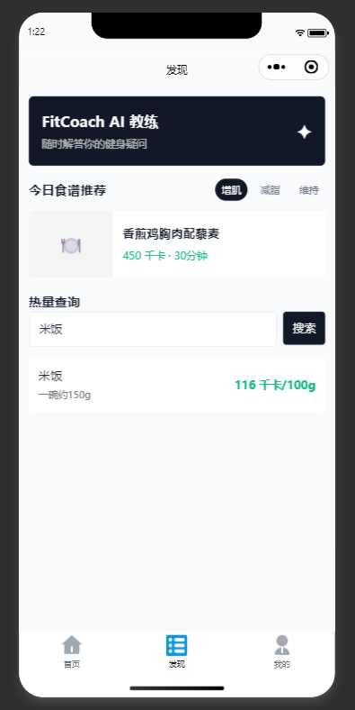
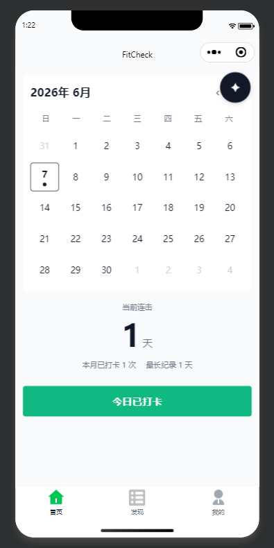
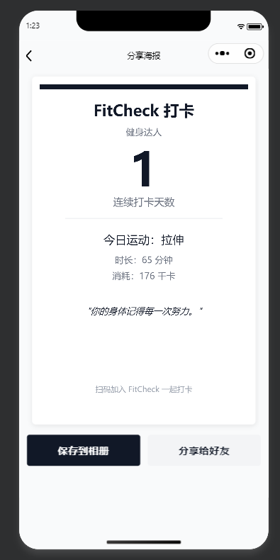
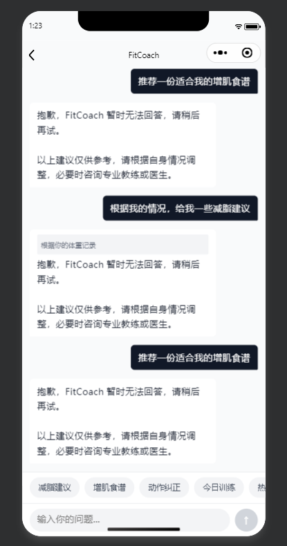

# FitCheck - 每日打卡健身小程序

<p align="center">
  <strong>极简健身记录工具，让每一次坚持都被看见</strong>
</p>

<p align="center">
  
  
  
</p>

---

## 产品简介

FitCheck 是一款专注于**极简打卡**的微信小程序，通过降低健身记录的门槛，利用**"连击天数"**的心理学机制提升用户留存，并借助微信社交生态实现自然裂变。

> **对健身新手**：用最简单的动作（点击+选择）完成记录，告别复杂表格。  
> **对自律人群**：可视化日历与连击天数提供持续的正向反馈。  
> **对社交用户**：一键生成精美海报，满足分享成就感的需求。

---

## 核心功能

### 1. 极简打卡签到
- 一键点击完成每日打卡
- 支持选择运动类型（有氧、力量、拉伸、游泳、瑜伽等）
- 滑动选择运动时长（15min / 30min / 45min / 60min / 90min+）
- 可选上传运动照片（健身房环境照、体脂秤截图等）
- 自动计算卡路里消耗（基于 MET 公式）

### 2. 日历视图与连击激励
- 月度日历网格直观展示打卡记录
- 已打卡日期显示绿色圆点徽章
- **当前连击天数**：大号数字激励展示
- **本月打卡次数**与**最长连击记录**统计

### 3. 个人身体档案
- 记录初始体重 / 当前体重 / 目标体重
- 近 7 天 / 近 30 天体重变化趋势图（Canvas 绘制）
- 历史记录列表，支持左滑删除

### 4. 发现页 - 食谱与热量
- **今日食谱推荐**：按增肌 / 减脂 / 维持分类轮播
- **热量查询**：搜索食物名称，展示每 100g 热量与常见分量参考

### 5. AI 健身问答 - FitCoach
- 全屏聊天界面，随时咨询健身问题
- 快捷问题标签：减脂建议、增肌食谱、动作纠正、今日训练等
- AI 自动引用用户体重、打卡记录提供个性化建议
- 支持清空对话历史

### 6. 分享海报
- 打卡成功后生成精美分享海报
- 包含用户昵称、连续打卡天数、今日运动数据、激励文案
- 支持保存到相册或分享给好友

---

## 界面预览

### 首页 - 日历打卡
<p align="center">
  
</p>

首页展示月度日历视图，已打卡日期以绿色圆点标记。日历下方显示当前连击天数（大号数字激励）、本月打卡次数与最长纪录。底部通栏"今日打卡"按钮，一键进入打卡流程。

---

### 发现页 - 食谱与热量查询
<p align="center">
  
</p>

发现页顶部为 FitCoach AI 教练入口卡片，中部展示今日食谱推荐（支持增肌/减脂/维持筛选），底部为热量查询搜索框，输入食物名称即可查看每 100g 热量与常见分量参考。

---

### 个人中心
<p align="center">
  
</p>

个人中心展示用户头像与昵称，功能列表包括：身体档案、数据统计、AI 健身问答、分享海报、设置。底部显示版本号 FitCheck v1.0。

---

### 分享海报
<p align="center">
  
</p>

打卡成功后生成的分享海报，展示用户昵称、连续打卡天数（大字突出）、今日运动类型与时长、消耗卡路里、随机激励文案（如"你的身体记得每一次努力"），底部附带小程序码，支持保存到相册或分享给好友。

---

### AI 健身问答 - FitCoach
<p align="center">
  
</p>

全屏聊天界面，顶部显示 FitCoach 标题与状态指示器。用户消息右对齐（深色背景+白色文字），AI 消息左对齐（白色卡片+深色文字）。底部快捷标签栏支持一键发送预设问题，输入栏支持多行文本输入。AI 回复末尾自动附加免责声明。

---

## 技术栈

| 层级 | 技术 |
|------|------|
| 前端框架 | 微信小程序原生框架 (WXML / WXSS / JS / JSON) |
| 数据存储 | 微信本地 Storage + 云开发 (CloudBase) |
| 云函数 | Node.js 云函数 (AI 对话、打卡记录、用户数据) |
| 图表绘制 | 小程序 Canvas 2D API |
| 海报生成 | Canvas 绘制 + DPR 高清适配 |

---

## 项目结构

```text
├── cloudfunctions/          # 云函数
│   ├── aiChat/              # AI 对话云函数
│   ├── checkin/             # 打卡记录云函数
│   ├── dbHelper/            # 数据库辅助云函数
│   └── user/                # 用户相关云函数
├── miniprogram/
│   ├── pages/               # 页面
│   │   ├── index/           # 首页：日历 + 打卡 + 连击
│   │   ├── checkin/         # 打卡详情页
│   │   ├── discover/        # 发现页：食谱 + 热量查询
│   │   ├── profile/         # 个人中心
│   │   │   └── body-archive/# 身体档案（体重趋势图）
│   │   ├── ai-chat/         # AI 健身问答
│   │   ├── poster/          # 分享海报
│   │   ├── stats/           # 数据统计
│   │   └── settings/        # 设置页
│   ├── components/          # 公共组件
│   ├── utils/               # 工具函数
│   └── images/              # 图片资源
├── PRD.md                   # 产品需求文档
├── IA.md                    # 信息架构文档
├── VISUAL.md                # 视觉规范文档
└── README.md                # 项目说明
```

---

## 视觉风格

- **设计调性**：自律、纯粹、专注、克制、数据感
- **主色调**：`#111827`（深灰黑）+ `#10B981`（翠绿，用于成功状态）
- **背景色**：`#F9FAFB`（浅灰白）
- **字体**：系统默认字体栈（PingFang SC / Microsoft YaHei 等）
- **图标风格**：极简线性图标，2px 线条粗细
- **设计理念**：像一张干净的白纸，只记录最重要的行动，没有任何多余的干扰

---

## 快速开始

1. 克隆项目到本地
2. 使用微信开发者工具打开 `miniprogram` 目录
3. 在开发者工具中创建云开发环境
4. 部署云函数（右键云函数目录 -> 创建并部署：云端安装依赖）
5. 编译预览

---

## 文档资料

- [产品需求文档 (PRD)](./PRD.md) - 功能需求矩阵、数据模型、AI 逻辑说明
- [信息架构文档 (IA)](./IA.md) - 页面结构树、交互逻辑、导航流程
- [视觉规范文档 (VISUAL)](./VISUAL.md) - 色彩系统、字体排版、组件规范、动画交互

---

## 待办功能 (Roadmap)

- [ ] P1: 运动类型自定义标签
- [ ] P2: 每日健身饮食建议（内置 30 套食谱）
- [ ] P2: 外部食物热量数据库接入
- [ ] P3: 订阅消息打卡提醒
- [ ] P3: 补卡机制（广告/分享解锁）
- [ ] P3: 好友排行榜 / 打卡小队

---

## 免责声明

FitCheck 提供的所有健身与饮食建议仅供参考，请根据自身情况调整，必要时咨询专业教练或医生。

---

<p align="center">
  <sub>FitCheck v1.0 - 用自律雕刻更好的自己</sub>
</p>
